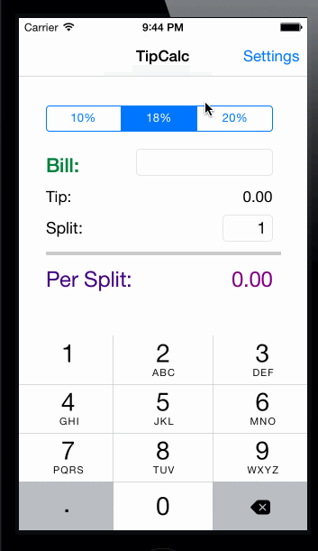

# Tip Calculator

This is an iOS demo application for calculating tips.

Time spent: 10 hours spent in total

Completed user stories:

 * [x] Required: Create a Settings view controller
 * [x] Required: Design the Settings page
 * [x] Required: Loading and saving
 * [x] Required: View controller lifecycle
 * [ ] Optional: Momentarily remember the bill amount across app restarts
 * [ ] Optional: Add a light/dark color theme

Walkthrough:

GIF created with [LiceCap](http://www.cockos.com/licecap/).
